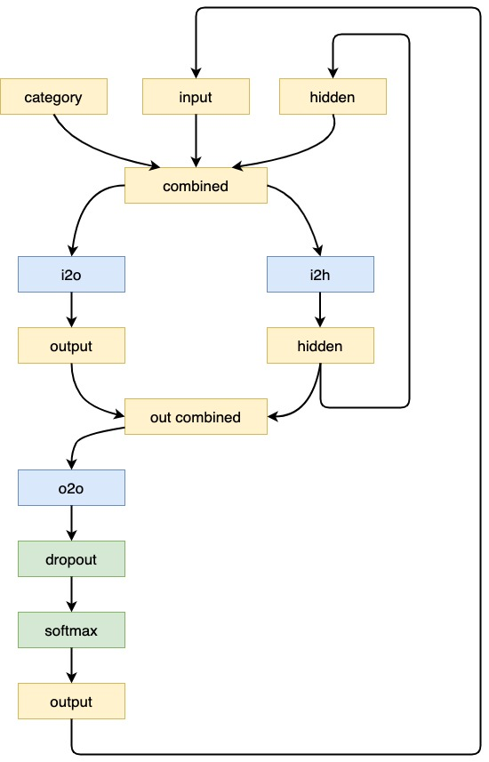
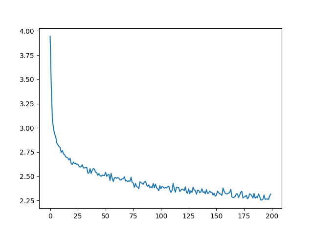
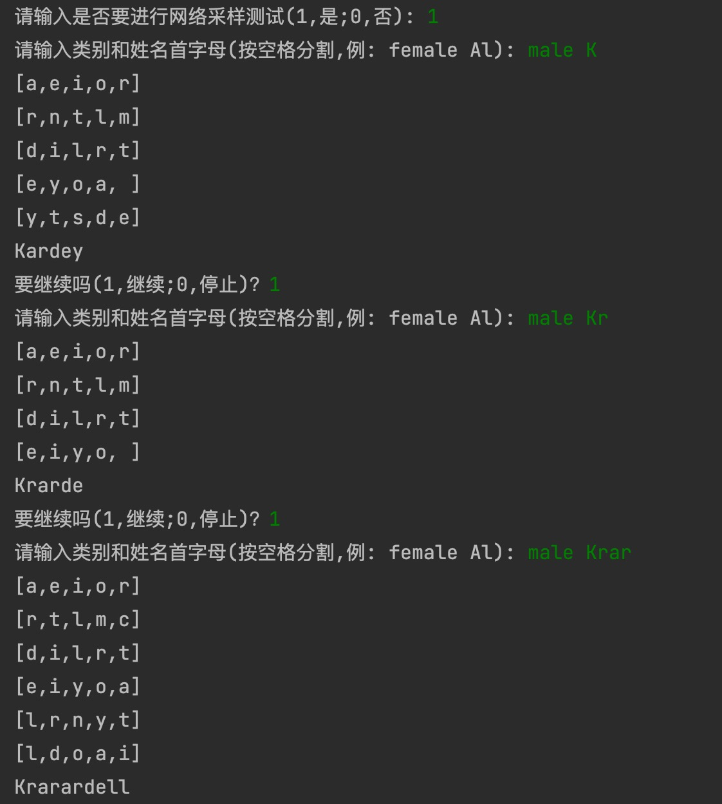

# AdML_A5

### 问题陈述

任务（20分）：用于起名字的循环神经网络

· 数据：8000多个英文名字

· 采用已有的英文名字，训练一个RNN，实现一个起名字的计算机程序，当输入名字的第一个或前几个字母时，程序自动生成后续的字母，直到生成一个名字的结束符。

· 采用可视化技术，绘制出模型为每个时刻预测的前5个最可能的候选字母。 


附加题（10分）：

· 事实上，你也可以给定结尾的若干个字母，或者随意给出中间的若干个字母，让RNN补全其它字母，从而得到一个完整的名字。请尝试设计并实现一个这样的RNN模型。

· 从模型生成的名字中，挑选你最喜欢的一个，并采用可视化技术，绘制生成这个名字的过程。 


背景知识：给定大量的文本数据，可训练一个基于循环神经网络的语言模型，该模型可用于计算一个句子的出现概率（P(w1, w2, ..., wT)），或者根据上文中的词推断某个词作为下一个词的出现概率（P(wt｜w1, w2, ..., wt-1)）。


###  数据集处理

读入名字数据集，形成数组。并把 Unicode 转换成 ASCII 编码, 最后放进一个字典里。

```python
def Unicode_to_ASCII(s):
    return ''.join(
        c for c in unicodedata.normalize('NFD', s)
        if unicodedata.category(c) != 'Mn'
        and c in all_letters
    )
```

### 网络模型

网络结构如下图所示：


输出层采用softmax函数，为了让网络更加有效工作，添加了第二个线性层o2o（在合并了隐藏层和输出层的后面）。为了延缓过拟合，本网络也加入了Dropout 层，使输入的部分值以给定的概率值随机的变成 0（这里概率取0.1）。

### 实验结果

在本次实验中，迭代次数选择为10万次，Loss下降曲线如下：



实验结果如下：



可以看出，在给出一个或多个字母时，模型可以给出自动生成后续的字母以组成一个名字。输出中也给出了每个时刻预测的前5个最可能的候选字母。
